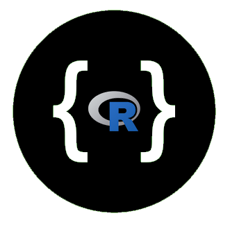

---
output:
  md_document:
    variant: markdown_github
---

<!-- README.md is generated from README.Rmd. Please edit that file -->

```{r, echo = FALSE}
knitr::opts_chunk$set(
  collapse = TRUE,
  comment = "#>",
  fig.path = "README-"
)
```



swagger is an R package to create API packages from [Swagger.io](http://swagger.io/) JSON specifications.

The following functions are implemented:

- `swag`:	Build an R web API package from a swagger definition

### News

- Version 0.0.0.9000 released

### Installation

```{r eval=FALSE}
devtools::install_github("hrbrmstr/swagger")
```

```{r echo=FALSE, message=FALSE, warning=FALSE, error=FALSE}
options(width=120)
```

### Usage

```{r}
library(swagger)

# current verison
packageVersion("swagger")

```

### Test Results

```{r}
library(swagger)
library(testthat)

date()

test_dir("tests/")
```

### Code of Conduct

Please note that this project is released with a [Contributor Code of Conduct](CONDUCT.md). 
By participating in this project you agree to abide by its terms.
